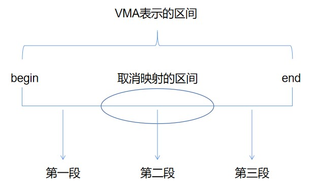

## Lab10 mmap(<font color=red>hard</font>)

（复习操作系统的时候，过于无聊，因为题目都写不来，于是做了这个lab，比做题有意思多了。这个实验是hard，不过我做的很顺利，感觉有一种自己变强的假象hhh）

```c
void *mmap(void *addr, size_t length, int prot, int flags,
           int fd, off_t offset);
```

这个实验要求实现mmap中的内存映射文件相关功能的子集，因此后文中mmap均表示内存映射文件（实际上mmap还能映射匿名地址）

### VMA

VMA(virtual memory area)：在一个地址空间（针对虚拟地址），可能包含多个section，每个section都由一个连续的地址段构成，对于每个section，都有一个VMA对象。例如一个进程的代码是一个section，数据是另一个section，它们对应不同的VMA。再比如，如果进程有个memory mapped file，那么对于这段地址，会有一个VMA与之对应，其中包含文件权限，文件本身信息等。

对于mmap来说，结构体VMA应该包含地址段的起始地址，长度，权限，被映射的文件等信息。另外，要在PCB中加入VMA成员来表示某个进程的mmap情况。一个进程可能映射多个文件，题目保证16个VMA足够了。

```c
struct VMA {
  uint64 begin;
  uint64 mark; // 标识位
  int mapped;
  int len;
  int prot;
  int flags;
  struct file *f;
};

struct proc {
  // ...
  struct VMA VMAs[16];
}
```

VMA结构体中的mark会在后面解释它的作用，mapped成员表示该VMA是否被使用了，除此之外，其他成员的作用都很明显。

### sys_mmap

用户使用系统调用mmap时就会进入内核执行sys_mmap，这里采用的策略是lazy alloction，mmap并不分配并映射物理内存，只是抬高myproc()->size，等到后面出现page fault时，才做这些工作。lazy alloction的目的是：

1. 确保大文件的mmap是快速的

2. 比物理内存大的文件的mmap是可能的

```c
uint64
sys_mmap(void)
{
  // 获取4个参数(addr默认就是0)
  uint64 addr;
  int len, prot, flags, offset;
  struct file *f;

  if (argint(1, &len) < 0 || argint(2, &prot) < 0 || argint(3, &flags) < 0 || 
      argfd(4, 0, &f) < 0 || argint(5, &offset) < 0) {
    return -1;
  }

  // 这里加一个特判，如果文件打开方式是只读，而映射方式是可写的
  // 并且能写回文件，那么就映射失败
  if (f->writable == 0 && (prot & PROT_WRITE) && (flags & MAP_SHARED)) {
    return -1;
  }

  len = PGROUNDUP(len); // mmap中映射的长度必须是页对齐的

  for (int i = 0; i < 16; i ++) {
    if (myproc()->VMAs[i].mapped == 0) {
      myproc()->VMAs[i].begin = myproc()->sz;
      myproc()->VMAs[i].mark = myproc()->sz;
      myproc()->VMAs[i].mapped = 1;
      myproc()->VMAs[i].len = len;
      myproc()->VMAs[i].prot = prot;
      myproc()->VMAs[i].flags = flags;
      myproc()->VMAs[i].f = f;
      filedup(f); // 增加文件的引用计数，以便文件关闭时结构体不会消失

      addr = myproc()->sz;
      myproc()->sz += len; // lazy allocation
      return addr;
    }
  }
  return -1; // 没有足够的VMA
}
```

### page fault

当mmap出现page fault时，需要做的是：

1. 申请一页物理内存

2. 计算文件的偏移量，从文件中向物理内存写入内容

3. 建立产生page fault的虚拟地址和上述物理地址的映射

由于对mmap的访问可以是随机的，所以第2步中的计算文件偏移量是必要的，缺页地址-mmap起始地址就等于文件偏移量。

```c
void
usertrap(void)
{
  // ...
  } else if (r_scause() == 13) { // 虚拟地址没有映射
    if (r_stval() >= p->sz || r_stval() <= p->trapframe->sp) {
      p->killed = 1;
    } else {
      uint64 va = PGROUNDDOWN(r_stval()); // 出错的虚拟地址
      // 找到对应的VMA
      struct VMA *tmp;
      int i;
      for (i = 0; i < 16; i ++) {
        tmp = &(p->VMAs[i]);
        if (tmp->mapped == 1 && (va >= tmp->begin && va < (tmp->begin + tmp->len)))
          break;
      }
      if (i >= 16) // 没找到，说明va不正确
        p->killed = 1;
      else {
        uint64 pa = (uint64)kalloc(); // 分配一页物理地址
        if (pa == 0) {
          p->killed = 1;
        } else {
          memset((void *)pa, 0, PGSIZE);
          int read = 0, write = 0; // 等会儿va-pa映射的权限
          read = (tmp->prot & PROT_READ);
          if (read)                                                                                                                 read = PTE_R;
          write = (tmp->prot & PROT_WRITE);
          if (write)
            write = PTE_W;
          ilock(tmp->f->ip); // 由于readi要求ip必须上锁
          int n = PGSIZE < (tmp->begin + tmp->len - va) ? PGSIZE : (tmp->begin + tmp->len - va);
          readi(tmp->f->ip, 0, pa, va - tmp->begin, n);
          iunlock(tmp->f->ip);
          // 将虚拟地址映射到物理地址
          // printf("hello world\n");
          if (mappages(p->pagetable, va, PGSIZE, pa, PTE_U | read | write) != 0) {
            kfree((void *)pa);
            p->killed = 1;
          }
        }
      }
    }
  }
  // ...
}
```

### munmap

取消映射的情况会比较复杂。取消映射的地址和长度可以是随机的，所以取消映射后一段完整的VMA最多可能被截成3段，如下图：



为了正确表示被映射和已经被取消映射的内存的状况，我采取的方法是将一个VMA分裂为多个VMA，以上图为例，原本的VMA会被分裂成2个VMA，分别是第一段和第三段，用两个VMA结构体来表示，其中begin和len都可以计算得出，prot、flag、f都继承原来的VMA。第二段由于被取消映射了，所以不用给它分配VMA。此外，还要考虑原来的VMA的所有区间都被取消映射的情况，这时它应该减少相应`struct file`的引用计数。如果未映射的页面已被修改，并且文件已映射到`MAP_SHARED`，请将页面写回该文件。由于原来的VMA可能分裂成好几个了，无法判断是否所有区间都被取消映射，所以在VMA中加入mark，其值等于原本VMA的begin，这样在分裂的过程中，这个标识就被保留下来了，便于我们检查是否所有区间都被取消映射。

写回文件的操作参考filewrite

```c
uint64
munmap(uint64 addr, int len)
{
  addr = PGROUNDDOWN(addr); // addr向下页对齐
  len = PGROUNDUP(len); // len向上页对齐

  // struct proc *p = myproc();
  // printf("%d %d\n", p->VMAs[0].begin, p->VMAs[0].len);
  // 检查addr和len是否在合理范围内
  struct VMA *tmp;
  int i;
  for (i = 0; i < 16; i ++) {
    tmp = &(myproc()->VMAs[i]);
    if (tmp->mapped && addr >= tmp->begin && addr < tmp->begin + len && addr + len <= tmp->begin + tmp->len)
      break;
  }
  if (i >= 16) {
    printf("giao\n");
    return -1;
  }

  // 到这里说明范围检查合格了

  // 一个VMA最多被截成3段(begin0,len0),(begin1,len1),(begin2,len2)
  uint64 new_begin[3];
  int new_len[3];
  // 暂存被截VMA的信息
  uint64 tmp_mark = tmp->mark;
  int tmp_prot = tmp->prot, tmp_flags = tmp->flags;
  struct file *tmp_f = tmp->f;
  new_begin[0] = tmp->begin;
  new_begin[1] = addr;
  new_begin[2] = addr + len;
  new_len[0] = new_begin[1] - new_begin[0];
  new_len[1] = len;
  new_len[2] = tmp->begin + tmp->len - new_begin[2];

  memset(tmp, 0, sizeof(struct VMA));
  // 转移
  for (i = 0; i < 3; i ++) {
    if (new_len[i] == 0 || i == 1)
      continue;
    int j;
    for (j = 0; j < 16; j ++) {
      tmp = &(myproc()->VMAs[j]);
      if (tmp->mapped == 0) {
        tmp->mapped = 1;
        tmp->begin = new_begin[i];                                                                                              tmp->mark = tmp_mark;
        tmp->len = new_len[i];
        tmp->prot = tmp_prot;
        tmp->flags = tmp_flags;
        tmp->f = tmp_f;
        break;
      }
    }
    if (j >= 16) {
      printf("giaogiao\n");
      return -1; // 正常来说，这一句不会被执行到;
    }
  }
  // 检查MAP_SHARED，若是，则写回文件，这一部分参考filewrite
  if (tmp_flags == MAP_SHARED) {
    if (tmp_f->writable == 0)
      return -1;

    int r;
    int off = addr - tmp_mark;
    int max = ((MAXOPBLOCKS - 1 - 1 - 2) / 2) * BSIZE;
    int i = 0;
    while (i < len) {
      int n1 = len - i;
      if (n1 > max)
        n1 = max;

      begin_op();                                                                                                             ilock(tmp_f->ip);
      if ((r = writei(tmp_f->ip, 1, addr + i, off, n1)) > 0)
        off += r;
      iunlock(tmp_f->ip);
      end_op();

      if (r != n1) {
        break;
      }
      i += r;
    }
  }

  // 取消引用
  uvmunmap(myproc()->pagetable, addr, len / PGSIZE, 1);
  // 如果全部都被取消映射了，则file的引用计数-1
  for (i = 0; i < 16; i ++) {
    if (myproc()->VMAs[i].mark == tmp_mark)
      break;
  }
  if (i >= 16)
    filedec(tmp_f); // 这个函数式仿照filedup写的，起到完全相反的功能，在file.c中
  return 1;
}
```

以上有一个细节问题uvmunmap如果取消映射没有映射过得内存会panic，所以要修改uvmunmap

```c
void
uvmunmap(pagetable_t pagetable, uint64 va, uint64 npages, int do_free)
{
  uint64 a;
  pte_t *pte;

  if((va % PGSIZE) != 0)
    panic("uvmunmap: not aligned");

  for(a = va; a < va + npages*PGSIZE; a += PGSIZE){
    if((pte = walk(pagetable, a, 0)) == 0)
      panic("uvmunmap: walk");                                                                                   
    if((*pte & PTE_V) == 0)
      // LAB MMAP
      continue;
      // panic("uvmunmap: not mapped");
    if(PTE_FLAGS(*pte) == PTE_V)
      panic("uvmunmap: not a leaf");
    if(do_free){
      uint64 pa = PTE2PA(*pte);
      kfree((void*)pa);
    }
    *pte = 0;
  }
}
```

### 修改exit和fork

exit中应该取消映射由mmap映射的所有的地址

```c
exit(int status)
{
  // ...

  // LAB MMAP
  // munmap all mmapped address
  struct VMA *tmp;
  for (int i = 0; i < 16; i ++) {
    tmp = &(p->VMAs[i]);
    if (tmp->mapped) {
      munmap(tmp->begin, tmp->len);
    }
  }

  // ...
}
```

fork中应该复制VMAs到子进程，同时增加文件的引用计数

```c
int
fork(int)
{  
  // ...
  // LAB MMAP
  struct VMA *tmp;
  struct file *all_file[16];
  int count = 0;
  memset(all_file, 0, sizeof(struct file *) * 16);
  for (int i = 0; i < 16; i ++) {
    tmp = &(p->VMAs[i]);
    if (tmp->mapped) {
      memmove(&(np->VMAs[i]), tmp, sizeof(struct VMA)); // 复制VMA

      int j;
      for (j = 0; j < count; j ++) {
        if (all_file[j] == tmp->f) // 已经找到过了
          break;
    }
      if (j >= count) { // 没有找到过
        filedup(tmp->f); // 增加引用计数
        all_file[count ++] = tmp->f; // 将其放入集合
      }
    }
  }
  // ...
}
```

注意fork会调用uvmcopy，对于没有映射过得内存会panic，像修改uvmunmap一样修改uvmcopy即可。
