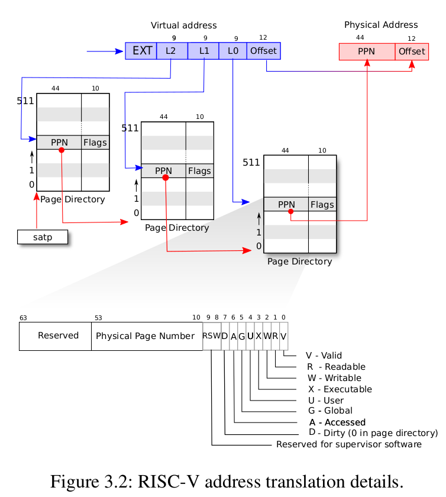
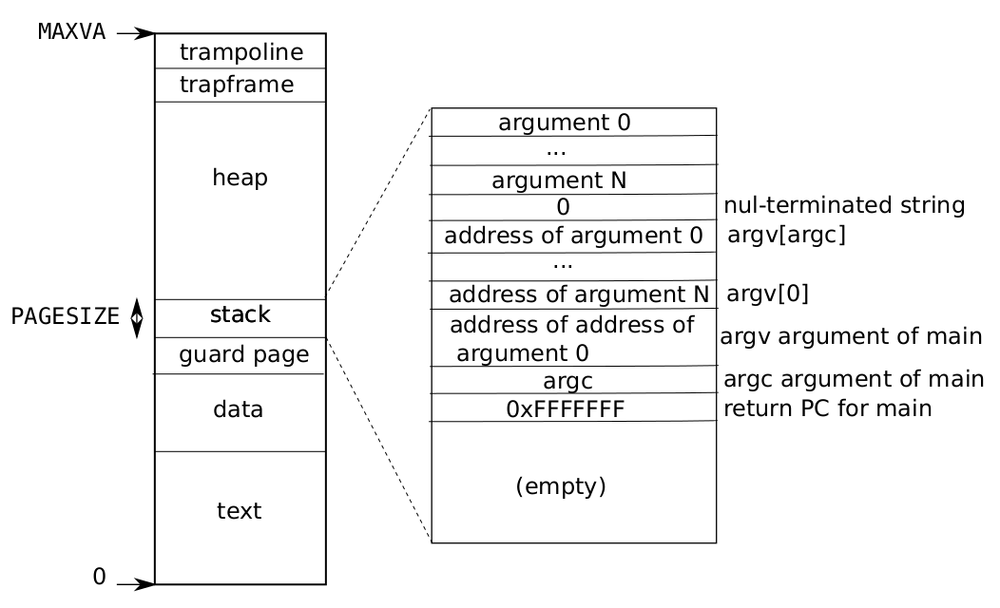
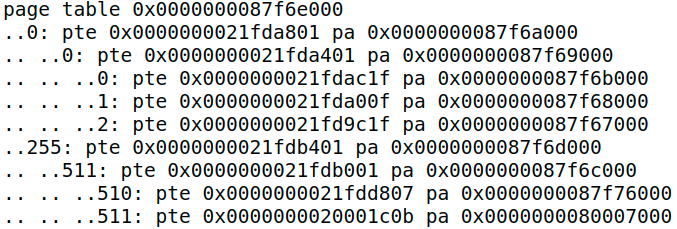
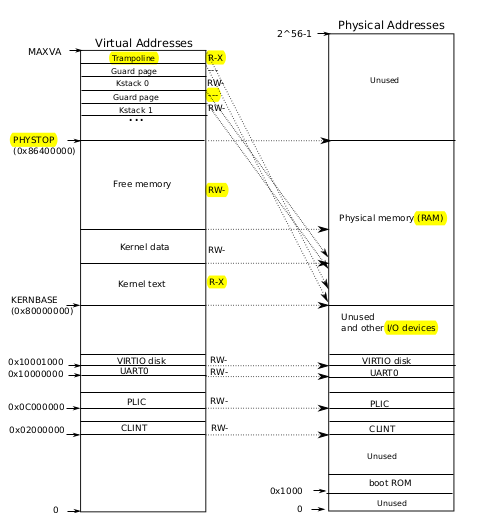

## Lab3 page tables

### 1. Print a page table(<span style="color:green;">easy</span>)

#### 1.1 题目

写一个`vmprint()`函数，该函数的参数是一个pagetable，以指定的形式打印pagetable。在exec.c的exec函数中插入`if (p->pid == 1) vmprint(p->pagetable)`，用以打印第一个进程的pagetable

#### 1.2 分析

这道题主要考察以下方面

+ 对PTE，PNN，FLAG等概念的理解
+ PTE转化为下一级pagetable物理地址的方法
+ xv6多级页表的结构，虚拟地址的组成以及位数，物理地址的组成以及位数
+ user address space的组成

xv6虚拟地址的组成：

| ETX          | L2   | L1   | L0   | offset |
| ------------ | ---- | ---- | ---- | ------ |
| 25位（无用） | 9位  | 9位  | 9位  | 12位   |

va转换为pa的过程：



2^9=512，所以每一级pagetable都有512个PTE，每个PTE是64位的，所以每个pagetable的大小为512×64/8=4096Byte，即一页。由此可知，pagetable也是按页分配的，**实际上`kalloc`就是按页分配的**。PTE中存的值很神奇，后10位表示下一页的权限信息（合法，读，写，可执行，用户可用等），定义在`riscv.h`中：

```c
#define PTE_V (1L << 0) // valid
#define PTE_R (1L << 1)
#define PTE_W (1L << 2)
#define PTE_X (1L << 3)
#define PTE_U (1L << 4) // 1 -> user can access
```

将最后10位丢弃以后再在后面添12个0,变成64位，得到下一级pagetable的pa。

+ **问题：为什么要补12个0？**

+ **答：因为pagetable是按页分配的，补12个0刚好可以让地址变成4096的倍数。**

<font color=#ff0000>可以将pagetable理解成一个有512个inidex的数组，只不过这个数组是三级的，最后一级才会获取pa</font>

**需要注意的是，va中L2实际上只有8位，所以第一级页表只有256（0-255）个PTE**


**user address space:**



#### 1.3 实现

比较简单，直接递归打印即可。

```c
void
vmprint(pagetable_t pagetable)
{
	static int flag = 0;
	static int level = 2; //表示pagetable所在的level
	if (level < 0)
		return;
	if (!flag) {
		printf("page table %p\n", pagetable);
		flag = 1;
	}
	for (int i = 0; i < 512; i ++) {
		pte_t pte = pagetable[i];
		if (pte & PTE_V) {
			if (level == 2)
				printf("..");
			else if (level == 1)
				printf(".. ..");
			else
				printf(".. .. ..");
			uint64 child = PTE2PA(pte); //将pte中的值转换为下一级页表的pa，通过函数PTE2PA，在riscv.h中声明
			printf("%d: pte %p pa %p\n", i, pte, child);
			level -= 1;
			vmprint((pagetable_t)child);
			level += 1; //恢复现场
		}
	}
}

```

注意观察输出结果：



一点解释：这个用户程序是init，在`kernel/proc.c`中，在函数`userinit`中被加载进了第一个process，因为我们需要`if (p->pid == 1) vmprint(p->pagetable)`来打印。

+ page 0的最后两位是1f，换成二进制就是00011111，可以得到对应的权限，根据该权限以及它的pte编号，查看user address space图可知，它映射是text和data（在init程序中，text和data合一起了）
+ page 2同理可得映射的是stack

+ page 1没有user权限，映射的是guard page
+ page 511的最后两位是0b，换成二进制就是00001011,它是合法的，有可执行，读权限，但是没有写权限，在加上它是从顶部被映射，所以应该是trampoline（trampoline：contains the instructions transition in and out of the kernel）
+ 为啥第一级页表最大只有255,而不是 511,明明映射的是va最大的trampoline。答：L2只用了8位


### 2. A kernel page table per process (<font color=#ff00>hard</font>)

#### 2.1 题目

背景：kernel有一个全局kernel pagetable，而每个进程都有一个process pagetable。当进入内核态，若kernel使用一个用户指针（va）时，往往需要通过查找三级页表的方法来获取pa，本题和下一题的目的就是通过每个进程的kernel pagetable，可以让kernel直接deference va得到pa，不需要通过手动walk，~~来让内核程序员过得更轻松一些~~

将kernel的映射都复制到每个进程的kernel pagetable中，这样当进程在kernel中执行时可以使用自己的kernel pagetable。

#### 2.2 分析

kernel address space的映射方式，左边虚拟地址，右边是物理地址



在PHYSTOP以下，kernel address space 的映射方式是恒等映射。KERNBASE以下是device，以上是RAM。对于device的i映射在`kernel/vm.c`中的kvminit函数，中间的kernel text和kerneldata就是kernel所在的位置了。顶部的kstack映射方式不是恒等映射，而是把它放得很高，映射到下面，**之所以把kstack放得这么高，是因为stack从高处向下延伸，并且需要guard page来防止kstack过大，一旦kstack“侵入”guard page，由于guard page的pte的flag PTE_U是0,用户不允许访问，因此会触发异常**。kstack的映射是在`kernel/vm.c`中的procinit函数分配的。

这里讨论一下物理内存的分配。所有物理内存的分配都是通过kalloc函数，在`kernel/kalloc.c`中。上面一直说的pagetable，其内存也需要分配，而分配的内存就在上图`free memory`对应的物理地址。内存**按页分配**，free memory的每一页都是由链表串起来的，详情见`kalloc.c`。kstack的空间也是由kalloc分配的，再将其通过pagetable和va建立映射。

#### 2.3 实现

+ 在`struct proc`中加入`pagetable_t kernel_pagetable`这样每个进程就都有自己的kernel_pagetable了

+ 写一个函数proc_kpagetable来为每个进程申请kernel_pagetable的空间，借用函数uvmcreate

  ```c
  pagetable_t
  proc_kpagetable(void)
  {
    pagetable_t kpagetable = uvmcreate();
    uvmmap(kpagetable, UART0, UART0, PGSIZE, PTE_R | PTE_W);
    uvmmap(kpagetable, VIRTIO0, VIRTIO0, PGSIZE, PTE_R | PTE_W);
    uvmmap(kpagetable, CLINT, CLINT, 0x10000, PTE_R | PTE_W);
    uvmmap(kpagetable, PLIC, PLIC, 0x400000, PTE_R | PTE_W);
    uvmmap(kpagetable, KERNBASE, KERNBASE, (uint64)etext-KERNBASE, PTE_R | PTE_X);
    uvmmap(kpagetable, (uint64)etext, (uint64)etext, PHYSTOP-(uint64)etext, PTE_R | PTE_W);
    uvmmap(kpagetable, TRAMPOLINE, (uint64)trampoline, PGSIZE, PTE_R | PTE_X);
  
    return kpagetable;
  }
  
  ```

+ 因为进程申请是通过`allocporc`函数，所以在该函数中调用proci_kpagetable函数

+ 此时KERNBASE以下的device部分映射好了，还需要为每个进程申请kstack，方法基本可以参考userinit函数中的相关代码。现对该函数分析：

  ```c
  // initialize the proc table at boot time.
  void
  procinit(void)
  {
    struct proc *p;
    
    initlock(&pid_lock, "nextpid");
  
    for(p = proc; p < &proc[NPROC]; p++) {
        initlock(&p->lock, "proc");
  			
        // Allocate a page for the process's kernel stack.
        // Map it high in memory, followed by an invalid
        // guard page.
        char *pa = kalloc();
        if(pa == 0)
          panic("kalloc");
        uint64 va = KSTACK((int) (p - proc));
        kvmmap(va, (uint64)pa, PGSIZE, PTE_R | PTE_W);
        p->kstack = va;
    }
    kvminithart();
  }
  ```

  该函数直接为**每个进程**都分配了kstack，不管这个进程目前是否使用或创建。因而日后如果创建进程的话，可以省略映射kstack步骤，因为已经映射好了。然而这是在全局kernel pagetable实现的，为了将映射实现在用户自己的kernel pagetable上（`kvmmap`），我们需要移植这个功能。**<font color=red>但是，移植完以后务必将procinit中的映射注释掉，否则，每个进程的kstack将被映射两次，且两次被映射到不同的物理地址上，这就出现了问题。</font>**最终allocproc如下：

  ```c
  static struct proc*
  allocproc(void)
  {	
      ...
  	// Allocate a kernel_pagetable
  	p->kernel_pagetable = proc_kpagetable();			
  	// 映射kernel stack
  	char *pa = kalloc();
  	if (pa == 0)
  		panic("kalloc");
  	uint64 va = KSTACK((int) (p - proc));
  	uvmmap(p->kernel_pagetable, va, (uint64)pa, PGSIZE, PTE_R | PTE_W);
  	p->kstack = va;
  	...
  }
  ```

+ free kernel_pagetable，当一个进程结束时，需要释放这个进程的空间（物理地址），包括页表和kstack，因为这两个是通过kalloc申请来的。由于页表有三层，所以需要递归地释放

  ```c
  void
  proc_freekpagetable(pagetable_t pagetable, int level)
  {
  	if (level < 0)
  		return;
  	for (int i = 0; i < 512; i ++) {
  		pte_t pte = pagetable[i];
  		if ((pte & PTE_V) && (pte & (PTE_R | PTE_W | PTE_X)) == 0) {
  			uint64 child = PTE2PA(pte);
  			proc_freekpagetable((pagetable_t)child, level - 1);
  			pagetable[i] = 0;
  		}
  	}
  	kfree(pagetable);
  	pagetable = 0;
  }
  ```

  而kstack空间的释放，可直接调用uvmunmap函数，最终freeproc函数为：

  ```c
  static void
  freeproc(struct proc *p)
  {
      ...
  	if (p->kstack)
  		uvmunmap(p->kernel_pagetable, p->kstack, 1, 1);
  	p->kstack = 0;
  
  	if (p->kernel_pagetable)
  		proc_freekpagetable(p->kernel_pagetable, 2);
  	p->kernel_pagetable = 0;
  	...
  }
  ```

  **<font color=red>注意这里一定要先释放kstack，再释放页表，否则如果先释放页表，kstack将无处可循，这部分的内存再也找不到了，造成了内存泄漏。</font>**

+ scheduler进程调度。scheduler函数中，当选定某个进程执行前，需要将用户的kernel_pagetable载入satp（通过w_satp函数），并刷新TLB（通过sfence_vma函数）。调用结束后，需要切换会全局kernel pagetable

  ```c
  void
  scheduler(void)
  {
      ...
  	w_satp(MAKE_SATP(p->kernel_pagetable));
  	sfence_vma();
  
      swtch(&c->context, &p->context); // 上下文切换？
  
  	kvminithart(); // 恢复kernel
  	...
  }
  ```


### 3. Simplify copyin/copyinstr(<font color=red>hard</font>)

#### 3.1 题目

通过以上的步骤，我们还是没能实现对va的directly dereference，不过我们已经迈出了很重要的一步了。上面我们一直是通过walk的方式来得到pa，而所谓directly dereference，就是指给定一个va，直接取消引用(*va)就能够得到pa。在执行某个用户进程时，scheduler会将该进程的pagetable（pa）载入satp，**<font color=red>如果我们将user program映射到proc' kernel pagetable</font>**，那么给定一个va，mmu就会从该页表里自动walk来寻找pa。而这一切的前提就是satp指向那个pagetable，mmu是依赖于satp指定的页表的.

因此我们的任务就是将user program映射到用户的kernel pagetable

#### 3.2 实现

+ 将user program映射到用户的kernel pagetable

  ```c
  void
  user2kpagetable(pagetable_t kpagetable, pagetable_t pagetable, uint64 oldsz, uint64 newsz)
  {
  	if (newsz >= PLIC)
  		panic("user2pagetable: too big sz");
  
  	for (int i = oldsz; i < newsz; i += PGSIZE) {
  		pte_t *upte = walk(pagetable, i, 0);
  		if (upte == 0) {
  			panic("user2kpagetable: unmaped va");
  		}
  		if ((*upte & PTE_V) == 0) {
  			panic("user2kpagetable: invalid va");
  		}
  		
  		pte_t *kpte = walk(kpagetable, i, 1);
  		*kpte = *upte;
  		*kpte = *kpte & ~PTE_U; // 将kpte的PTE_U置为0,因为题目里说“A page with PTE_U set cannot be accessed in kernel mode”
  	}
  }
  ```

  这里直接复制最后一级页表的pte即可，**<font color=red>实际上除了为了实现映射而申请的各级pagetable外，并没有消耗其他内存</font>**

+ 在exec，fork以及sbrk中加入上述函数调用，因为这几个函数都修改（创建，扩大或载入）了user program，需要将其映射到用户的kernel pagetable。

  ```c
  //exec
  int exec(char *path, char **argv)
  {
      ...
  #ifdef LAB3_PGTBL
  	user2kpagetable(p->kernel_pagetable, p->pagetable, 0, p->sz);
  #endif 
      ...
  }
  ```

  ```c
  //fork
  int fork(void)
  {
      ...
  #ifdef LAB3_PGTBL
  	user2kpagetable(np->kernel_pagetable, np->pagetable, 0, np->sz);
  #endif 
      ...
  }
  ```

  注意在fork中，虽然子进程np是父进程p的副本，它们在pa中的内容都一样，但是还是要复制子进程np到进程的kernel pagetable，原因是，如果父进程在子进程返回之前就exit了，我们父进程就会被释放，里面的内容也就随之消失了，所以要复制子进程。

  ```c
  //sbrk
  // Grow or shrink user memory by n bytes.
  // Return 0 on success, -1 on failure.
  int
  growproc(int n)
  {
    uint sz;
    struct proc *p = myproc();
  
    sz = p->sz;
  	uint64 oldsz = sz;
    if(n > 0){
      if((sz = uvmalloc(p->pagetable, sz, sz + n)) == 0) {
        return -1;
      }
    } else if(n < 0){
      sz = uvmdealloc(p->pagetable, sz, sz + n);
    }
    p->sz = sz;
  
  #ifdef LAB3_PGTBL
  	user2kpagetable(p->kernel_pagetable, p->pagetable, oldsz, p->sz);
  #endif
  
    return 0;
  }
  ```

  user2kpagetable函数中的参数newsz和oldsz就是为sbrk服务的，因为sbrk扩大或缩小，需要对增量部分映射

+ 在copyin和copyinstr中调用copyin_new和copyinstr_new。这相当与是对上述工作的检验，因为原来的copyin和copyinstr函数是调用walk来获取pa的，而copyin_new和copyinstr_new是通过取消引用来获取pa的
