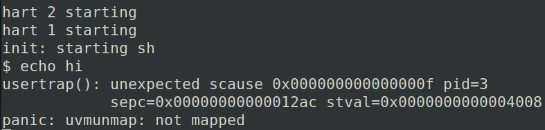

## Lab5 xv6 lazy page allocation

### 1. Eliminate allocation from sbrk()(<font color=green>easy</font>)

#### 1.1 题目

删除sbrk系统调用中的页面分配代码，旧的sbrk将进程的内存大小增加n个字节，然后返回新分配区域的开始部分（即旧的大小），新的sbrk应该只将进程的大小sz增加n，然后返回旧的大小。它不应该分配内存——因此您应该删除对`growproc()`的调用（但是您仍然需要增加进程的大小！）。

完成以后运行`$ echo hi`

#### 1.2 实现

这题只要完完全全按照题目的意思去做就行了，下面直接给出新的sbrk的实现：

```c
uint64
sys_sbrk(void)
{
  int addr;
  int n;

  if(argint(0, &n) < 0)
    return -1;
  addr = myproc()->sz;
  // if(growproc(n) < 0)
  //   return -1;
  myproc()->sz += n;
  return addr;
}
```

运行结果为：



下面来详细分析一下这个输出结果

+ 这段输出表示在`trap.c`中的`usertrap`函数中，`scause`寄存器记录进入`trap`的原因，下表是scause的值及原因

  

  可以看到，15表示发生了`Store/AMO page fault`，大概的意思就是说在写入page时发生了错误，这与我们的预期是符合的，因为新的sbrk只是将sz提高了，但没有真正分配物理内存(通过uvmalloc)。所以当对这些地址进行写操作的时候就会出错。

+ pid3表示trap的进程的编号。<font color=red>这极有可能是sh的编号</font>。

+ `sepc`寄存器存的是出错的指令地址(其实根据Lab4 trap的知识，我们知道sepc实际上存的是使得进入trap的指令的地址)，如果我们查看`user/sh.asm`，可以看到

  ```assembly
  12ac:	01652423          	sw	s6,8(a0)
  ```

  这是一条store指令，这印证了scause。

  如果我们再查看这条指令所在的函数，它对应的是`malloc`。`malloc`通过sbrk来申请内存，在user address space上就体现在变量的地址在heap上。但是由于新的sbrk并不会实际分配内存，所以写入时就会出错。

+ `stval`表示出错的va。一个可以证明内存还没有分配的地方是，XV6中Shell通常是有4个page，包含了text和data。出错的地址在4个page之外，也就是第5个page，实际上我们在4个page之外8个字节。这也合理，因为在0x12a4对应的指令中，a0持有的是0x4000，而8相对a0的偏移量。偏移之后的地址就是出错的地址

### 2. Lazy allocation(<font color=blue>moderete</font>)

#### 2.1 题目

修改***trap.c***中的代码以响应来自用户空间的页面错误

#### 2.2 实现

+ 在第一部分中，失败的原因是：**我们没有在`usertrap`中完成相应的解决方案**

  ```c
  void
  usertrap(void)
  {
    //...
        } else if (r_scause() == 15 || r_scause() == 13) {
      	if (r_stval() >= p->sz || r_stval() <= p->trapframe->sp) {
  		  p->killed = 1;
  	    } else {
  		  uint64 va = PGROUNDDOWN(r_stval());
  		  uint64 pa = (uint64)kalloc();
  	      if (pa == 0) {
  	        p->killed = 1;
  	      } else {
  		    memset((void *)pa, 0, PGSIZE);
  		    if (mappages(p->pagetable, va, PGSIZE, pa, PTE_W | PTE_R | PTE_U) != 0) {
  		      kfree((void *)pa);
  		      p->killed = 1;
  		    }
  	      }
          }
        } else {
    //...
  }
  ```

  我们来运行一下：

  

  在释放没有映射的空间时出错

+ 上面bug出现的原因很简单，由于sbrk并没有真正分配内存，所以释放这部分内存的时候会出错，一个解决方案是，当要释放这种内存的时候，直接continue

  ```c
  void
  uvmunmap(pagetable_t pagetable, uint64 va, uint64 npages, int do_free)
  {
    //...
    for(a = va; a < va + npages*PGSIZE; a += PGSIZE){
      if((pte = walk(pagetable, a, 0)) == 0)
        panic("uvmunmap: walk");
      if((*pte & PTE_V) == 0)
        // panic("uvmunmap: not mapped");
  	  continue;
      if(PTE_FLAGS(*pte) == PTE_V)
        panic("uvmunmap: not a leaf");
      if(do_free){
        uint64 pa = PTE2PA(*pte);
        kfree((void*)pa);
      }
      *pte = 0;
    }
  }
  ```

  此时运行已经可以成功了

### 3. Lazytests and Usertests(<font color=blue>moderate</font>)

切入点：处理`sbrk()`参数为负的情况。

sbrk参数为负，说明需要减小空间，此时不能像sbrk参数为正一样处理（直接简单地将sz减小），因为减小的这一部分空间可能真的分配了物理内存，需要将其释放

```c
uint64
sys_sbrk(void)
{
  int addr;
  int n;

  if(argint(0, &n) < 0)
    return -1;
  addr = myproc()->sz;
  // if(growproc(n) < 0)
  //   return -1;
	if (n >= 0)
		myproc()->sz += n;
	else {
		if (growproc(n) < 0) // growproc函数中会改变sz的大小
			return -1;
	}
  return addr;
}
// growproc函数中调用uvmdealloc，uvmdealloc中又调用了uvmunmap，这里方便起见，直接调用了prowproc，不过使用uvmdealloc或uvmunmap都是可以的
```

运行一下程序：


触发了uvmunmap的`panic: uvmunmap: walk`

这是walk的返回值为0所致，去walk函数看看，发现

```c
pte_t *
walk(pagetable_t pagetable, uint64 va, int alloc)
{
    //...
	if(*pte & PTE_V) {
      pagetable = (pagetable_t)PTE2PA(*pte);
    } else {
      if(!alloc || (pagetable = (pde_t*)kalloc()) == 0)
        return 0;
      //...
      }
    //...
}
```

同样也是因为`(*pte & PTE_V == 0)`导致的，所以要在uvmunmap中将这个panic注释掉并continue，所以最终的uvmunmap函数为：

```c
void
uvmunmap(pagetable_t pagetable, uint64 va, uint64 npages, int do_free)
{
  //...
  for(a = va; a < va + npages*PGSIZE; a += PGSIZE){
    if((pte = walk(pagetable, a, 0)) == 0)
      // panic("uvmunmap: walk");
	  continue;
    if((*pte & PTE_V) == 0)
      // panic("uvmunmap: not mapped");
	  continue;
    if(PTE_FLAGS(*pte) == PTE_V)
      panic("uvmunmap: not a leaf");
    if(do_free){
      uint64 pa = PTE2PA(*pte);
      kfree((void*)pa);
    }
    *pte = 0;
  }
}
```

再次运行：


发现已经可以通过一个测试点了，但是在第二个测试点挂了，挂了的原因是uvmcopy报panic

有点摸不着头脑，于是用gdb调试：


可以发现函数调用的历史，看样子可能是fork时出了问题，所以去看看fork做了啥。

众所周知，fork的作用是`crear a new process, copying the parent.`，里面调用uvmcopy函数来将父进程的user memory复制进子进程（通过pagetable），uvmcopy和uvmunmap很相似，因为父进程有的page实际并不存在`((*pte & PTE_V)  == 0)`，所以就panic了。解决方法也很简单，对于这种page直接跳过即可。

```c
int
uvmcopy(pagetable_t old, pagetable_t new, uint64 sz)
{
  for(i = 0; i < sz; i += PGSIZE){
    if((pte = walk(old, i, 0)) == 0)
      // panic("uvmcopy: pte should exist");
      continue;
    if((*pte & PTE_V) == 0)
      // panic("uvmcopy: page not present");
      continue;
    //...
    }
  }
  //...
}
```

再次运行：


发现lazytests都过掉了

运行usertests：


发现挂了一个地方

根据hint，`Handle the case in which a process passes a valid address from sbrk() to a system call such as read or write, but the memory for that address has not yet been allocated.`一开始我没看懂这句话啥意思，后来稍微理解了一点，就是说给了一些syscall（比如write，read等）的参数地址（va），但是对应的物理地址并没有被分配，这时候就需要分配内存。举个例子来说，write的第一个参数是文件描述符，第二个参数是用户给的buffer，第三个参数是写的长度，如果buffer的地址是在heap中，而对应的物理内存并没有被分配，就会在syscall中出错。

对argaddr函数修改如下

```c
int
argaddr(int n, uint64 *ip)
{
  *ip = argraw(n);
  if (walkaddr(myproc()->pagetable, *ip) == 0) {
	if (*ip >= myproc()->sz || *ip <= myproc()->trapframe->sp)
	  return -1;
	uint64 va = PGROUNDDOWN(*ip);
	uint64 pa = (uint64)kalloc(); 
    if (pa == 0)
	  return -1;
	memset((void *)pa, 0, PGSIZE);
	if (mappages(myproc()->pagetable, va, PGSIZE, pa, PTE_W | PTE_R | PTE_U) != 0) {
	  kfree((void *)pa);
	  return -1;
	}
  }
  return 0;
}
```

​		

